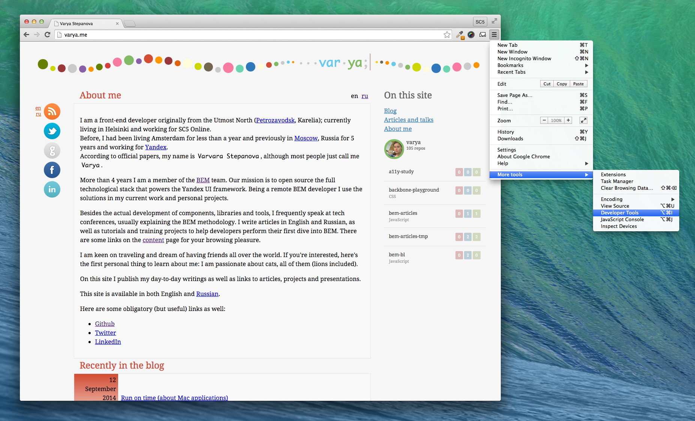
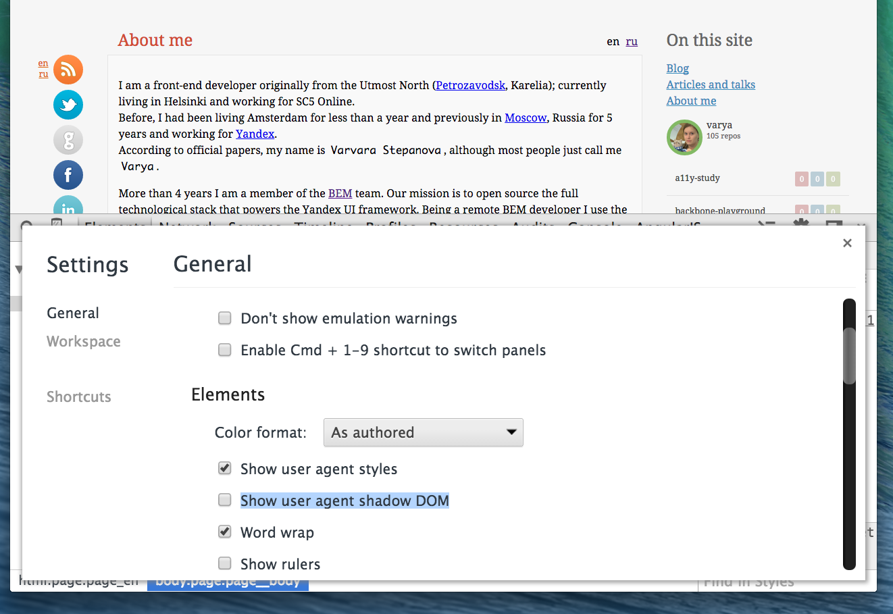

---

layout: default

style: |

  .slide table th,
  .slide table td {
    background: none;
  }

  .no-title h2 {
    display: none;
  }

  .two-codes table td {
    width: 50%;
  }

---

# Component development in CSS

*by [Varya Stepanova](http://varya.me/) from [SC5 Online](http://sc5.io/)*{: .cover}

<!-- picture from http://hdwallpaperart.com/ -->

## About me

## Spoiler

You will learn:

TODO: List

## CSS

*First published in 1996*

> *Cascading Style Sheets* (CSS) is a style sheet language used for describing the look and formatting of a document
> written in a markup language.

[Wikipedia](https://en.wikipedia.org/wiki/Cascading_Style_Sheets)

<!-- CSS was designed to enable the separation of document content from document presentation. The specification was
first published in 1996. -->

## Industry challenges

Not your cat's homepage

## Bulletproof Web Desing
{: .bulletproof .no-title }

<!-- First place which I know where the industry needs were explained and requirements to the resultant product were
given is a book "Bulletproof Web Desing" by Dan Cederholm. It was first published in 2005 which is quite long ago for
such a rapid evolving inductry.

The idea is that HTML/CSS markup is not created once and forever. By 2005 industry needed it to be stable and
mantainable. -->

## Big CSS

* massive sites
* big teams of developers
* heavy UI
* long running projects

TODO: explain problems

## What makes CSS hard?

* Vertical centring
* Equal height columns
* Browser inconsistencies
* Unobvious tricks

<!-- All those things can be googled -->

## What are the real hard problems in CSS?

* Scoping
* Specificity conflicts
* Non-deterministic matches
* Dependency management
* Removing unused code

TODO: Explain each of them

## Where CSS is hard?
{: .no-title }

<table><thead>

<th markdown="1">

This is not hard in CSS

</th>

<th markdown="1">

This is!

</th>

</thead><tr>

<td markdown="1">

    #sidebar ul li a {
      <mark>color: red;</mark>
      <mark>display: block;</mark>
      <mark>padding: 1em;</mark>
    }

</td>

<td markdown="1">

    <mark>#sidebar ul li a</mark> {
      color: red;
      display: block;
      padding: 1em;
    }

</td>

</tr></table>

##Is this good?

    H1 { color: blue }
    P EM { font-weight: bold }
    A:link IMG { border: 2px solid blue }
    A:visited IMG { border: 2px solid red }
    A:active IMG { border: 2px solid lime }

<!-- CSS was created to make text bold and links underlined. It ideally suited
solving these problems. In many websites developers still use CSS like.

Actually this code from [CSS level 1 specification](http://www.w3.org/TR/CSS1/). It is
very simple, was recommended in 1996. Time passed and we met new chalenges.

Writing CSS is easy. It is very easy to read and it is very likely that you can
find the tricks you need at Stackoverflow. But architechting CSS is very difficult.

-->

##CSS needs architechture
{: .shout }

##CSS methodologies
{: .shout }

##OOCSS

##Nicole Sullivan
{: .nicole }

TODO: Nice styles

<!-- She proposed OOP for CSS. This was a little bit naive but this was a first attempt. -->

## SMACSS
{: .shout }

##Jonathan Snook

TODO: take picture from here http://pepelsbey.net/pres/bem-ok/en/?full#jonathan-snook

## BEM
{: .shout }

## BEM team

TODO: Vitaly Harisov & Sergey Berezhnoy

## BEM basics

## GetBem
{: .no-title }

[getbem.com](http://getbem.com/)

TODO: Nice styles

## Advanced BEM

## BemInfo
{: .no-title }

[bem.info](http://bem.info/)

## Web Components
{: .shout }

<!-- More info: https://developer.mozilla.org/en-US/docs/Web/Web_Components -->

## <video>

[video](demo/video.html)

## Web Components

* Custom Elements
* HTML Templates
* Shadow DOM
* HTML Imports

## Turn on dev tools
{: .dev-tools }

<!-- First turn on dev tools -->

## Turn on dev tools
{: .dev-tools2 .no-title }

## Trun on Shadow DOM
{: .shadow-dom }

{: .crop }

## Inside <video>

[video](demo/video.html)

## Custom web components

* [Custom web component](demo/custom-button.html)
* [Templates](demo/templates.html)
* [HTML import](demo/html-import.html)

<!-- The idea is that you can teach the browser how to deal with your custom components. -->

<!-- So, the CSS now can be scoped -->

## HTML imports, more

    <!-- Import element -->
    <link rel="import" href="google-map.html">

    <!-- Use element -->
    <google-map lat="37.790" long="-122.390"></google-map>

## Browsers' support

Almost nowhere :-)

## Web Components Polyfills

* Polymer
* WebComponents.org

TODO: Place logos

## Make it work

    <!-- Polyfill Web Components support for older browsers -->
    <mark></mark>

    <!-- Import element -->
    <link rel="import" href="google-map.html">

    <!-- Use element -->
    <google-map lat="37.790" long="-122.390"></google-map>

## Style guide driven development

## Summary
